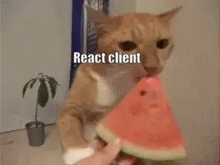

# Gocker 
Gocker is visualization web application to watch docker containers.

## Why 🤓☝️
I'm just tired of doing ``docker ps`` to know the state of my containers, that's all.
<p align="center">

</p>

## How does it work ⚙️
It's just a go Restful api with Chi that serves endpoint and it is consumed on a React client.

<p align="center">

</p>
<p align="center">
<i>Graphic explanation</i>
</p>

The api uses the Docker client to interact with Docker and get the info about the containers, either all the containers or just a specific one.<br>
The client is a SPA with React that consumes this api and renders the data in a way that does not damage the eyes.

##  How to run
You only need Docker and Docker compose:

### Step 1
Clone the repository
```sh
git clone https://github.com/Yoru-cyber/Gocker.git
``` 
### Step 2
Create the containers
```sh
docker compose up
``` 
## How is it built 🛠️

<p align="center">
  <a href="https://skillicons.dev">
    
  </a>
</p>
